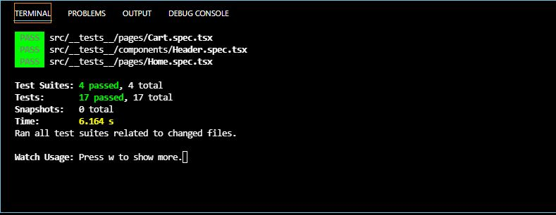

<h1 align="center">Ignite: Desafio 03 - Criando um hook de carrinho de compras</h1>

## :bookmark_tabs: Desafio

Utilizando o template disponibilizado, adicionar a lógica para as seguintes funcionalidades do carrinho:

  - Adicionar um novo produto;
  - Atualizar a quantidade de um produto no carrinho;
  - Remover um produto do carrinho;

Entre esses ações deve adicionar mensagens de erros e fazer cálculos para o preço. 

## :white_check_mark: Testes

## :sparkler: Aplicação

https://user-images.githubusercontent.com/34512572/156905293-cbb0b46f-c071-49f4-b25b-b829453a47fd.mp4

